# Full System Audit Report

**Repository:** E-Commerce Platform  
**Audit Date:** March 2026  
**Auditor:** Cascade AI  
**Scope:** Complete architecture, data flow, API, validation, security, and performance analysis

---

## 📚 Document Navigation

| ← Previous | Index | Next → |
|------------|-------|--------|
| [05-ui-data-alignment.md](./05-ui-data-alignment.md) | [00-index.md](./00-index.md) | [07-completion-roadmap.md](./07-completion-roadmap.md) |

**Related Documents:**
- API deep dive → [03-api-analysis.md](./03-api-analysis.md)
- Form issues → [04-form-audit.md](./04-form-audit.md)
- UI-Data alignment → [05-ui-data-alignment.md](./05-ui-data-alignment.md)
- Action plan → [07-completion-roadmap.md](./07-completion-roadmap.md)

---

## Executive Summary

This audit provides a comprehensive analysis of an early-stage Next.js 16-based e-commerce platform using tRPC, Drizzle ORM with PostgreSQL (Neon), Better Auth, and Zod validation. The system demonstrates solid architectural patterns but has significant gaps between implemented modules and production-ready requirements.

### Overall System Maturity: **🟡 Beta / Pre-Production (62%)**

| Domain | Status | Score |
|--------|--------|-------|
| Database Schema | ✅ Stable | 95% |
| API Layer | 🟡 Needs Improvement | 75% |
| Validation Layer | ✅ Stable | 85% |
| UI/Forms | ✅ Stable | 80% |
| Authentication | ✅ Stable | 85% |
| Business Logic | 🟡 Partial | 65% |
| Data Integrity | 🟡 Needs Improvement | 70% |
| Security | 🟡 Needs Improvement | 65% |

---

## 1. Architecture Overview

### 1.1 Directory Structure Analysis

```
src/
├── app/              # Next.js 16 App Router (90 items)
│   ├── (account)/    # Account dashboard routes
│   ├── (auth)/       # Authentication routes
│   └── (site)/       # Public site routes
├── core/             # Core infrastructure (18 items)
│   ├── api/          # tRPC configuration & routers
│   ├── auth/         # Better Auth configuration
│   ├── db/           # Drizzle ORM schema & config
│   ├── mail/         # Email service
│   ├── query/        # TanStack Query config
│   └── theme/        # Theme configuration
├── module/           # Feature modules (103 items)
│   ├── account/      # User account management
│   ├── attribute/    # ⚠️ NO API - Schema only
│   ├── auth/         # Authentication UI
│   ├── category/     # ✅ Full CRUD + UI
│   ├── cookies/      # Cookie consent
│   ├── inventory/    # ✅ Full CRUD + UI
│   ├── legal/        # Legal pages
│   ├── product/      # ✅ Full CRUD + UI
│   ├── product-variant/ # ✅ Full CRUD + UI
│   ├── series/       # ✅ Full CRUD
│   ├── site/         # Site-wide components
│   ├── subcategory/  # ✅ Full CRUD
│   └── user/         # ⚠️ NO API - Directory only
└── shared/           # Shared resources (130 items)
    ├── components/   # Reusable UI components
    ├── config/       # Configuration files
    ├── schema/       # Shared Zod schemas
    ├── styles/       # Global styles
    ├── types/        # Shared TypeScript types
    └── utils/        # Utility functions
```

### 1.2 Tech Stack Summary

| Layer | Technology | Version | Status |
|-------|-----------|---------|--------|
| Framework | Next.js | 16.0.0 | ✅ Current |
| Language | TypeScript | 5.x | ✅ Current |
| Styling | Tailwind CSS | 4.x | ✅ Current |
| Components | Radix UI | Latest | ✅ Stable |
| ORM | Drizzle ORM | 0.44.7 | ✅ Current |
| Database | PostgreSQL (Neon) | Serverless | ✅ Stable |
| API | tRPC | 11.0.0 | ✅ Current |
| Auth | Better Auth | 1.3.32 | ✅ Current |
| Validation | Zod | 3.25.1 | ✅ Current |
| Forms | React Hook Form | 7.65.0 | ✅ Current |
| Email | React Email + Resend | 0.5.7 / 6.3.0 | ✅ Current |

---

## 2. Module Relationships

### 2.1 Registered tRPC Routers (Core + Commerce)

```mermaid
graph TD
    A[appRouter] --> B[categoryRouter]
    A --> C[subcategoryRouter]
    A --> D[seriesRouter]
    A --> E[productRouter]
    A --> F[productVariantRouter]
    A --> G[inventoryRouter]
    A --> H[attributeRouter]
    A --> I[cartRouter]
    A --> J[wishlistRouter]
    A --> K[orderRouter]
    A --> L[paymentRouter]
    A --> M[addressRouter]
    A --> N[shipmentRouter]
    
    B --> B1[GET/GET_MANY/CREATE/UPDATE/DELETE]
    C --> C1[GET_MANY/GET_BY_SLUG/CREATE/UPDATE/DELETE]
    D --> D1[GET_MANY/CREATE/UPDATE/DELETE]
    E --> E1[GET/GET_MANY/GET_BY_SLUG/CREATE/UPDATE/DELETE/SEARCH]
    F --> F1[GET/GET_MANY/CREATE/UPDATE/DELETE]
    G --> G1[GET/GET_MANY/CREATE/UPDATE/DELETE/UPDATE_STOCK]
    H --> H1[GET_MANY/CREATE/UPDATE/DELETE]
    I --> I1[GET/GET_USER_CART/ADD/UPDATE/REMOVE/CLEAR/GET_TOTALS/MERGE]
    J --> J1[GET/ADD/REMOVE]
    K --> K1[GET/GET_MANY/CREATE/UPDATE_STATUS]
    L --> L1[CREATE_INTENT/CONFIRM/GET_STATUS]
    M --> M1[GET_MANY/CREATE/UPDATE/DELETE/SET_DEFAULT]
    N --> N1[CREATE/UPDATE_STATUS/GET_BY_ORDER]
```



### 2.2 Missing API Routers (Critical Gap)

| Module | Schema | API Router | Status |
|--------|--------|------------|--------|
| user | ✅ Auth-only | ✅ Auth-only | **STABLE** |
| account | ✅ Auth-only | ✅ Auth-only | **STABLE** |
| media | ✅ DB Only | ❌ Missing | **MEDIUM** |

---

## 3. API & Schema Alignment

### 3.1 Consistency Patterns

#### ✅ Consistent Elements

1. **Response Wrapper Pattern**: All APIs use standardized response format
   ```typescript
   API_RESPONSE(STATUS, message, data, error?)
   ```

2. **Contract Pattern**: Each module exports a `contract` object with input/output schemas
   ```typescript
   export const moduleContract = {
     get: { input: z.object({...}), output: detailedResponse(schema) },
     create: { input: z.object({...}), output: detailedResponse(schema) },
     // ...
   }
   ```

3. **Procedure Types**: Clear distinction between
   - `publicProcedure` - No auth required
   - `protectedProcedure` - Authenticated users only
   - `adminProcedure` - Admin role required
   - `customerProcedure` - User/Admin roles

#### ❌ Inconsistencies Found

1. **Category Update Logic Bug** (`category.api.ts:232-239`):
   ```typescript
   // BUG: Logic checks if slug exists for SAME id (always true)
   const existingSlug = await db.query.category.findFirst({
     where: and(eq(category.slug, body.slug), eq(category.id, params.id)),
   })
   if (existingSlug) { return API_RESPONSE(STATUS.FAILED, 'Slug exists', null) }
   // Should be: ne(category.id, params.id) to check OTHER records
   ```

2. **Procedure Usage Inconsistency**:
   - `series.getMany` uses `protectedProcedure` (should be `publicProcedure` for storefront)
   - `product.get` uses `protectedProcedure` (inconsistent with `getBySlug` using `publicProcedure`)

3. **Response Status Logic Flaws**:
   - Multiple endpoints return `STATUS.FAILED` when result is empty (should be `SUCCESS` with empty array)
   - `category.getMany` returns FAILED for empty results but `product.getMany` returns SUCCESS

---

## 4. Forms & Tables Integrity

### 4.1 Form System Architecture

The form system at `src/shared/components/form/` demonstrates excellent reusability:

```typescript
// Unified Form Component
<Form
  schema={categoryContract.create.input}
  defaultValues={{ body: { title: '', slug: '', ... } }}
  onSubmitAction={handleSubmit}
>
  <Form.Field type="text" name="body.title" label="Title" />
  <Form.Field type="slug" name="body.slug" slugField="body.title" />
  <Form.Field type="image" name="body.image" />
  <Form.Field type="select" name="body.visibility" options={[...]} />
  <Form.Submit />
</Form>
```

#### ✅ Strengths

1. **Dynamic Field Registry**: 15 field types in `fields.config.tsx`
2. **Type Safety**: Full TypeScript integration with Zod schemas
3. **Validation Integration**: `zodResolver` from `@hookform/resolvers`
4. **Status Badge**: Real-time form validation feedback
5. **Dynamic Loading**: Next.js dynamic imports with skeleton loading states

#### ❌ Issues Found

1. **Missing Form Implementations**:
   - No `attribute` form (schema exists, no UI)
   - No `user` management form
   - No `cart` management form
   - No `order` management form

2. **Form Data Mapping Issues** (`category.component.form.tsx:47-62`):
   ```typescript
   // Manual field mapping is error-prone
   createCategory.mutate({
     body: {
       slug: data.body.slug,
       title: data.body.title,
       // ... manual mapping of every field
     }
   })
   // Should pass data.body directly or use spread
   ```

### 4.2 Table Components

| Module | Table Component | Status |
|--------|-----------------|--------|
| category | `category.component.listing.tsx` | ✅ Implemented |
| product | Missing generic table | ❌ Not Found |
| inventory | Missing generic table | ❌ Not Found |

**Gap**: No reusable `DataTable` component found despite having `@tanstack/react-table` as a dependency.

---

## 5. Data Modeling & Validation

### 5.1 Database Schema Analysis

#### ✅ Well-Designed Elements
1. **Soft Delete Pattern**: `deletedAt` timestamp on major entities
2. **Proper Indexing Strategy**: Confirmed for catalog and cart/inventory.
3. **Drizzle Relations**: Properly defined for eager loading
4. **Commerce Schema**: Full set of tables for Orders, Payments, Shipments, Addresses, and Discounts implemented.

#### ❌ Schema Drift & Issues

1. **Missing Tables for Defined Enums**:
   ```typescript
   // Enums defined but NO corresponding tables:
   export const orderStatusEnum = pgEnum('order_status', ['pending', 'paid', 'shipped', 'delivered', 'cancelled'])
   export const paymentStatusEnum = pgEnum('payment_status', ['pending', 'completed', 'failed', 'refunded'])
   export const paymentProviderEnum = pgEnum('payment_provider', ['stripe', 'razorpay', 'paypal', 'cod'])
   export const shipmentStatusEnum = pgEnum('shipment_status', ['pending', 'in_transit', 'delivered'])
   ```

2. **Migration History Reveals Schema Instability**:
   - `0001_wild_jack_murdock.sql`: Dropped 15 tables including `order`, `payment`, `cart`, `inventory`
   - `0004_calm_jasper_sitwell.sql`: Re-created `cart`, `cart_line`, `inventory_item`, `inventory_reservation`, `wishlist`
   - Pattern suggests iterative development without forward-compatible migrations

3. **Foreign Key Constraint Inconsistencies**:
   ```sql
   -- Some use CASCADE, others NO ACTION
   ALTER TABLE "account" ADD CONSTRAINT ... ON DELETE cascade
   ALTER TABLE "cart_item" ADD CONSTRAINT ... ON DELETE no action
   ALTER TABLE "attribute" ADD CONSTRAINT ... ON DELETE no action
   ```

4. **JSON Field Usage** (Potential Data Integrity Risk):
   ```typescript
   // No schema enforcement at DB level
   features: json('features').$type<{ title: string }[]>()
   attributes: json('attributes').$type<{ title: string; type: string; value: string }[]>()
   media: json('media').$type<{ url: string }[]>()
   ```

### 5.2 Zod Schema Alignment

#### ✅ Strengths

1. **Consistent Pattern**: `baseSchema` → `selectSchema` → `insertSchema` → `updateSchema`
2. **Contract Pattern**: Input/output validation for every API endpoint
3. **Type Inference**: Proper use of `z.infer<typeof schema>`

#### ❌ Schema Mismatches

1. **Product Variant priceModifierValue Type Mismatch**:
   ```typescript
   // Schema (product-variant.schema.ts:31)
   priceModifierValue: z.string().default('0')
   
   // Database (db.schema.ts:277)
   priceModifierValue: numeric('price_modifier_value', { precision: 10, scale: 2 }).notNull()
   
   // API Layer (product-variant.api.ts:39)
   priceModifierValue: body.priceModifierValue // Passed as string to numeric field
   ```

2. **Missing Validation for DB Constraints**:
   - No unique constraint validation in Zod schemas (slug uniqueness)
   - No foreign key existence validation before insert
   - No enum value validation matching database enums

---

## 6. Security Review

### 6.1 Authentication (Better Auth)

#### ✅ Strengths

1. **Modern Auth Stack**:
   - Better Auth with Drizzle adapter
   - Two-factor authentication plugin enabled
   - Passkey/WebAuthn support
   - Admin plugin with role-based access control
   - Email verification required
   - Rate limiting with database storage

2. **Session Security**:
   ```typescript
   session: {
     cookieCache: { enabled: true, maxAge: 60 * 60 } // 1 hour
   }
   ```

3. **Social Auth**: GitHub OAuth configured

#### ❌ Security Gaps

1. **Role-Based Access Control (RBAC) Implementation**:
   ```typescript
   // permissions.ts - Minimal implementation
   export const user = ac.newRole({
     ...userAc.statements,
     user: [...userAc.statements.user, 'list'],
   })
   // Missing: Custom resource-level permissions for e-commerce entities
   ```

2. **No Resource-Level Authorization**:
   - APIs check `protectedProcedure` but don't verify user owns the resource
   - Example: Any authenticated user could potentially update any category
   - Missing middleware: `enforceOwnership(userId, resource)`

3. **Missing Security Headers**: No explicit Content Security Policy configuration found

4. **No Input Sanitization**: Direct string interpolation in search queries
   ```typescript
   // SQL Injection Risk (category.api.ts:40)
   conditions.push(ilike(category.title, `%${input.query.search}%`))
   // Should use parameterized queries or proper escaping
   ```

### 6.2 API Security

| Check | Status | Notes |
|-------|--------|-------|
| Rate Limiting | ✅ | Better Auth rate limiter enabled |
| CORS | ⚠️ | Not explicitly configured |
| CSRF Protection | ⚠️ | Relies on SameSite cookies |
| Input Validation | 🟡 | Zod validation present but gaps |
| SQL Injection | ❌ | String interpolation in queries |
| XSS Prevention | ⚠️ | No explicit output encoding |

---

## 7. Performance & Scalability

### 7.1 Database Performance

#### ✅ Optimizations Present

1. **Indexing Strategy**: B-tree indexes on frequently queried fields
2. **Query Pagination**: Consistent `limit`/`offset` patterns
3. **Selective Field Queries**: Using `.returning()` to limit data transfer

#### ❌ Performance Risks

1. **N+1 Query Risk** (`subcategory.api.ts:53-55`):
   ```typescript
   const subcategoryData = await db.query.subcategory.findFirst({...})
   const seriesData = await db.query.series.findMany({...}) // Additional query
   // Should use with: { series: true } relation loading
   ```

2. **No Query Result Caching**: No Redis/caching layer found

3. **Missing Connection Pooling**: Default Neon serverless pooling (acceptable for scale)

4. **Unbounded Queries** (`category.getManyByTypes:120-139`):
   ```typescript
   // Fetches ALL categories 4 times without limit
   const featuredCategories = await db.query.category.findMany({...})
   const [publicCategories, privateCategories, hiddenCategories] = await Promise.all([...])
   const recentCategories = await db.query.category.findMany({ limit: 10 })
   const deletedCategories = await db.query.category.findMany({...}) // No limit!
   ```

### 7.2 Frontend Performance

| Aspect | Status | Notes |
|--------|--------|-------|
| Code Splitting | ✅ | Dynamic imports for form fields |
| Image Optimization | ⚠️ | Uses Next.js Image but no explicit sizing strategy |
| Bundle Analysis | ❌ | No bundle analyzer configured |
| Query Optimization | 🟡 | TanStack Query with basic config |
| Virtual Scrolling | ✅ | `@tanstack/react-virtual` available |

---

## 8. Reusability & Consistency

### 8.1 Component Reusability Score: 75%

#### ✅ Excellent Patterns

1. **Form Field Registry**: 15 field types with consistent API
2. **Contract Pattern**: Reusable across all modules
3. **Response Utils**: `API_RESPONSE` helper used consistently
4. **UI Component Library**: 56 shadcn/ui-based components

#### ❌ Duplication & Inconsistency

1. **Multiple detailedResponse Definitions**: Found in 6+ files with identical code
   - Should be in `shared/schema/common.ts`

2. **Pagination Schema Duplication**:
   ```typescript
   // Every module defines its own:
   const paginationSchema = z.object({
     limit: z.number().min(1).max(100).default(20),
     offset: z.number().min(0).default(0),
   })
   ```

3. **Inconsistent Error Handling**:
   ```typescript
   // Some use debugError
   debugError('CATEGORY:UPDATE:ERROR', err)
   // Others don't
   // Some include err, others don't
   ```

### 8.2 Naming Conventions

| Pattern | Usage | Consistency |
|---------|-------|-------------|
| `module.component.form.tsx` | ✅ Used | 90% |
| `module.component.edit-form.tsx` | ✅ Used | 80% |
| `module.component.listing.tsx` | ✅ Used | 70% |
| `module.component.card.tsx` | ✅ Used | 90% |
| `module.api.ts` | ✅ Used | 100% |
| `module.schema.ts` | ✅ Used | 100% |
| `module.types.ts` | ✅ Used | 90% |

---

## 9. Technical Debt Ledger

### 🔴 Critical Risk (Immediate Action Required)

| ID | Issue | Location | Impact | Fix Effort |
|----|-------|----------|--------|------------|
| ID | Issue | Location | Impact | Fix Effort |
|----|-------|----------|--------|------------|
| CR-001 | **Checkout UI & Payment Gateway Integration Missing** | Commerce UI + payment layer | Users cannot complete purchases yet | High |
| CR-002 | **No Resource Ownership Checks** | All protected procedures | Data exposure risk | High |
| CR-003 | **Category Update Slug Logic Bug** | `category.api.ts:232` | Prevents valid updates | Low |
| CR-004 | **Price Modifier Type Mismatch** | Schema/DB/API | Data corruption risk | Medium |
| CR-005 | **Attribute/Admin UIs Missing** | Studio UI | Attributes managed only via API | Medium |

### 🟠 High Risk (Address Within 2 Weeks)

| ID | Issue | Location | Impact | Fix Effort |
|----|-------|----------|--------|------------|
| ID | Issue | Location | Impact | Fix Effort |
|----|-------|----------|--------|------------|
| HI-001 | **SQL Injection in Search Queries** | Multiple API files | Security vulnerability | Low |
| HI-003 | **N+1 Queries in Subcategory API** | `subcategory.api.ts` | Performance degradation | Low |
| HI-004 | **Missing User Management APIs** | `module/user/` | Cannot manage users | Medium |
| HI-005 | **Inconsistent Soft Delete Enforcement** | Various queries | Data integrity issues | Medium |
| HI-006 | **No Database Transactions for Multi-Table Operations** | Most mutations | Partial update risk | Medium |

### 🟡 Medium Risk (Address Within 1 Month)

| ID | Issue | Location | Impact | Fix Effort |
|----|-------|----------|--------|------------|
| ME-001 | **Unbounded Queries in getManyByTypes** | `category.api.ts` | Memory/performance | Low |
| ME-002 | **Duplicated detailedResponse Definitions** | Multiple files | Maintenance burden | Low |
| ME-003 | **Missing Generic DataTable Component** | UI Components | Code duplication | Medium |
| ME-004 | **No Query Result Caching** | API Layer | Performance | Medium |
| ME-005 | **Inconsistent Error Message Handling** | API Layer | User experience | Low |
| ME-006 | **No Comprehensive Audit Trail** | Database | Compliance gap | High |
| ME-007 | **Missing Media Management API** | Module | Cannot manage uploads | Medium |

### 🟢 Low Risk (Address When Convenient)

| ID | Issue | Location | Impact | Fix Effort |
|----|-------|----------|--------|------------|
| LO-001 | **Unused Message Definitions** | `api.config.ts` | Dead code | Low |
| LO-002 | **Inconsistent Import Ordering** | Various | Code style | Low |
| LO-003 | **Missing JSDoc Comments** | Various | Documentation | Low |
| LO-004 | **No Bundle Analyzer Config** | Project | Optimization | Low |
| LO-005 | **Inconsistent Slug Generation Logic** | Various | Minor inconsistency | Low |

---

## 10. Phased Refactor & Stabilization Roadmap

### Phase 1: Critical Stabilization (Weeks 1-2)
**Goal: Fix blocking bugs and security vulnerabilities**

- [ ] Fix category update slug validation bug (CR-003)
- [ ] Fix product variant price modifier type mismatch (CR-004)
- [ ] Sanitize all search query inputs (HI-001)
- [ ] Implement resource ownership middleware (CR-002)
- [ ] Add database transactions for multi-table mutations (HI-006)

### Phase 2: Core E-Commerce Completion (Weeks 3-4)
**Goal: Enable full purchase flow**

- [x] Implement Cart API router with full CRUD (CR-001)
- [x] Implement Wishlist API router (HI-002)
- [x] Implement Order API router (CR-001)
- [x] Implement Payment API router (CR-001)
- [x] Implement Attribute API router (CR-005)
- [ ] Create cart/wishlist UI components

### Phase 3: Data Integrity & Performance (Weeks 5-6)
**Goal: Production-ready stability**

- [ ] Add comprehensive database indexes audit
- [ ] Implement query result caching (Redis/Upstash)
- [ ] Fix N+1 queries across all APIs (HI-003)
- [ ] Add request/response logging middleware
- [ ] Implement comprehensive audit trail tables
- [ ] Add database backup/restore procedures

### Phase 4: Code Quality & Maintainability (Weeks 7-8)
**Goal: Long-term maintainability**

- [ ] Extract shared `detailedResponse` to common schema
- [ ] Extract shared `paginationSchema` to common schema
- [ ] Create reusable `DataTable` component
- [ ] Implement Storybook for component documentation
- [ ] Add comprehensive API documentation (OpenAPI/tRPC docs)
- [ ] Implement E2E test suite (Playwright)

---

## 11. Module Status Summary

| Module | Schema | API | Forms | Tables | Status |
|--------|--------|-----|-------|--------|--------|
| **Auth** | ✅ | ✅ | ✅ | N/A | ✅ **Stable** |
| **Category** | ✅ | ✅ | ✅ | ✅ | ✅ **Stable** |
| **Subcategory** | ✅ | ✅ | ✅ | ⚠️ | 🟡 **Needs Improvement** |
| **Series** | ✅ | ✅ | ⚠️ | ❌ | 🟡 **Needs Improvement** |
| **Attribute** | ✅ | ✅ | ❌ | ✅ | 🟡 **API complete, UI missing** |
| **Product** | ✅ | ✅ | ✅ | ⚠️ | 🟡 **Needs Improvement** |
| **Product Variant** | ✅ | ✅ | ✅ | ⚠️ | 🟡 **Needs Improvement** |

**Legend:**
- Complete/Stable
- Partial/Needs Improvement
- Missing/Incomplete
- Partial/Has Issues
- ⚠️ Partial/Has Issues

---

## 12. Data Flow Analysis

### 12.1 Complete Flow: Category Creation

```
┌─────────────────────────────────────────────────────────────────────────────┐
│                         CATEGORY CREATION FLOW                              │
└─────────────────────────────────────────────────────────────────────────────┘

UI Layer (Form)
    │
    ▼
category.component.form.tsx
├── Form Provider (react-hook-form)
├── Zod Validation (categoryContract.create.input)
└── API Client Call
    │
    ▼
API Layer (tRPC)
    │
    ▼
category.api.ts: create
├── protectedProcedure (auth check)
├── Input Validation (Zod)
├── Slug Generation (if missing)
├── Database Insert
│   └── db.insert(category).values({...})
└── Response Wrapping
    └── API_RESPONSE(STATUS.SUCCESS, ...)
    │
    ▼
Database Layer (Drizzle)
    │
    ▼
PostgreSQL (Neon)
├── category table insert
├── Index updates (visibility_idx, is_featured_idx, etc.)
└── Constraint validation (slug_unique)
    │
    ▼
Response Flow
    │
    ▼
tRPC Response → TanStack Query Cache Update → Toast Notification → Router Redirect

✅ FLOW STATUS: Complete and Functional
```

### 12.2 Broken Flow: Attribute Management

```
┌─────────────────────────────────────────────────────────────────────────────┐
│                      ATTRIBUTE MANAGEMENT FLOW                                │
└─────────────────────────────────────────────────────────────────────────────┘

UI Layer
    │
    ▼
❌ NO FORM COMPONENT EXISTS
    │
    ▼
API Layer
    │
    ▼
❌ NO API ROUTER REGISTERED
    │
    ▼
Database Layer
    │
    ▼
✅ attribute table exists with proper schema
    │
    ▼
❌ FLOW BROKEN: Cannot reach database from UI

❌ FLOW STATUS: Non-functional - Schema only
```

### 12.3 Incomplete Flow: E-Commerce Purchase

```
┌─────────────────────────────────────────────────────────────────────────────┐
│                       E-COMMERCE PURCHASE FLOW                              │
└─────────────────────────────────────────────────────────────────────────────┘

Browse Products
    │
    ▼
✅ Product/Variant catalog (Complete)
    │
    ▼
Add to Cart
    │
    ▼
✅ Cart API (add/update/remove/clear with inventory reservation)
    │
    ▼
Checkout
    │
    ▼
✅ Order API (creates order from cart in a transaction and deducts inventory)
    │
    ▼
Payment
    │
    ▼
✅ Payment API (create intent / confirm / status — gateway integration pending)
    │
    ▼
Order Confirmation
    │
    ▼
🟡 Email notifications (templates exist, not yet wired to order/payment events)

🟡 FLOW STATUS: Core commerce APIs exist; checkout UI, payment gateway integration, and emails still missing
```

### 12.4 Enterprise Feature Flows (Post-MVP) 🏢

```
┌─────────────────────────────────────────────────────────────────────────────┐
│                      ENTERPRISE FEATURE FLOWS                               │
└─────────────────────────────────────────────────────────────────────────────┘

Shipment Tracking
    │
    ▼
🟡 shipment table exists (schema defined)
    │
    ▼
❌ shipment_event table (no API)
❌ carrier integration (no implementation)
❌ tracking page (no UI)

Discount/Promo Codes
    │
    ▼
🟡 discount table exists (schema defined)
🟡 order_discount junction exists
    │
    ▼
❌ discount router (no API)
❌ validation logic (no implementation)
❌ checkout integration (no UI)

Order Audit Logging
    │
    ▼
❌ order_status_history table
❌ order_audit_log table
❌ automatic recording middleware
❌ admin audit viewer

Product Reviews
    │
    ▼
❌ review table
❌ review router
❌ moderation system
❌ PDP review display

🏢 ENTERPRISE STATUS: All enterprise features require implementation
```

---

## 13. Minimum Critical Path to Production

### Must-Have (Non-Negotiable)

1. **Transaction Processing**
   - [ ] Cart API with inventory reservation
   - [ ] Order creation API
   - [ ] Payment integration (Stripe/Razorpay)
   - [ ] Order confirmation emails

2. **Security Hardening**
   - [ ] Fix SQL injection vulnerabilities
   - [ ] Implement resource ownership checks
   - [ ] Add rate limiting to all public endpoints
   - [ ] Security headers configuration

3. **Data Integrity**
   - [ ] Fix price modifier type mismatch
   - [ ] Fix category update bug
   - [ ] Add database transactions
   - [ ] Soft delete enforcement audit

### Should-Have (High Priority)

1. **Complete Catalog Management**
   - [ ] Attribute API and UI
   - [ ] Media management API
   - [ ] Bulk operations for products

2. **User Management**
   - [ ] User CRUD API
   - [ ] User profile management
   - [ ] Address management

3. **Order Management**
   - [ ] Order status workflow
   - [ ] Shipment tracking
   - [ ] Return/refund processing

### Nice-to-Have (Post-Launch)

1. **Analytics & Reporting**
2. **Advanced Search (Elasticsearch)**
3. **Recommendation Engine**
4. **Multi-warehouse Support**
5. **Inventory Forecasting**

---

## 14. Conclusion & Recommendations

### System Strengths

1. **Modern Tech Stack**: Latest Next.js, tRPC, Drizzle, Better Auth
2. **Type Safety**: Comprehensive TypeScript usage across the stack
3. **Component Reusability**: Well-designed form system with 15 field types
4. **Soft Delete Pattern**: Proper data retention strategy
5. **Authentication**: Enterprise-grade auth with 2FA and passkeys

### Critical Concerns

1. **Incomplete Core Functionality**: Cannot process orders/payments
2. **Security Vulnerabilities**: SQL injection risks, missing ownership checks
3. **Schema Drift**: Migration history reveals instability
4. **Missing APIs**: 6 of 12 potential modules lack API endpoints

### Recommended Immediate Actions

1. **Stop all feature development** until critical path is complete
2. **Fix security vulnerabilities** before any production deployment
3. **Implement order/payment flow** as the #1 priority
4. **Add comprehensive testing** before launch
5. **Conduct security audit** with external review

### Estimated Time to Production

| Scenario | Timeline | Confidence |
|----------|----------|------------|
| Minimal Viable (Cart + Order + Payment) | 4-6 weeks | Medium |
| Production Ready (All Critical + Security) | 8-10 weeks | Medium |
| Feature Complete (All Modules) | 16-20 weeks | Low |

---

## Appendices

### A. Dependency Vulnerabilities Check

Run the following to check for known vulnerabilities:
```bash
pnpm audit
```

### B. Database Migration Status

| Migration | Description | Status |
|-----------|-------------|--------|
| 0000 | Initial schema with all tables | ✅ Applied |
| 0001 | Major refactor - dropped 15 tables | ⚠️ Destructive |
| 0002 | Variant table schema changes | ✅ Applied |
| 0003 | Index additions + product_status enum | ✅ Applied |
| 0004 | Cart/inventory tables re-created | ✅ Applied |

### C. Environment Variables Required

```env
# Database
DATABASE_URL=

# Auth
BETTER_AUTH_SECRET=
GITHUB_CLIENT_ID=
GITHUB_CLIENT_SECRET=

# Email
RESEND_API_KEY=

# Storage (Vercel Blob)
BLOB_READ_WRITE_TOKEN=
```

---

*Report generated by Cascade AI - March 2026*
*For questions or clarifications, refer to specific file citations in the analysis.*
